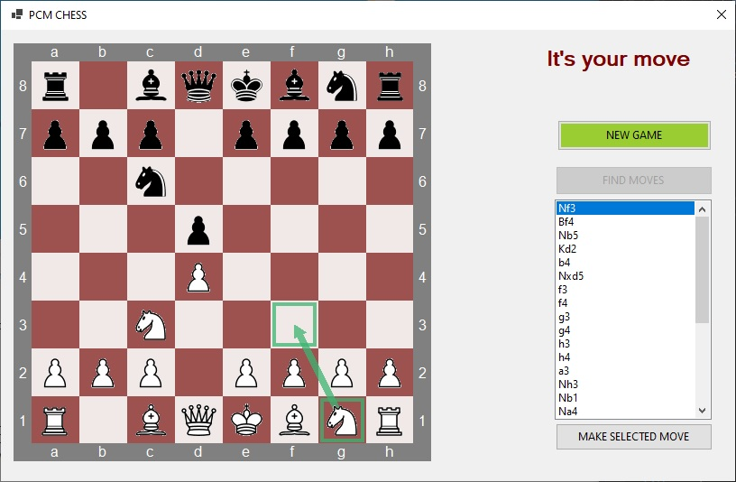

# A Chess engine library in C# #

This repo contains the code for a Chess engine library written in C#.

 

The PCMChessEngine solution consists of the following projects:

- **PCMChessEngineConsoleTestApp**: A simple console application that demonstrates the functionality of the library.
- **PCMChessEngineWinFormsApp**: A Windows Forms application that better demonstrates the functionality of the library (even though it is a bit of a crappy legacy application).
- **PCMChessEngineLib**: The code for the library itself.
- **PCMChessEngine.Tests**: A very small number of unit tests.

 

### Prerequisites

- [.NET Core 3.1 SDK](https://www.microsoft.com/net/download/core)

The test applications are .NET Core 3.1 applications. The library itself is a .NET Standard 2.0 library.  

 

### Why was this created?

I've been interested in the workings of computerised Chess programs for some time, so I finally figured I'd try writing one myself to get a deeper understanding.  
Mainly though, this was just done for fun :-)  
  
 

### Usage

The included **PCMChessEngineConsoleTestApp** and **PCMChessEngineWinFormsApp** projects demonstrate usage of the library.  

The **PCMChessEngineConsoleTestApp** application simply kicks off the computer playing a game against itself and dumps the state of the board after each move to a text file (called "GameDump.txt") in the folder containing the console application binary file.  
  
The **PCMChessEngineWinFormsApp** application gives an interactive display of the board and allows you to play against the computer. You play White (and obviously the computer plays Black) and you can move your pieces by clicking on them and dragging them to their new position (only legal moves can be made of course!).  
The "FIND MOVES" button can be clicked to request that the engine finds the legal moves that could be made at the current stage of the game - these are shown in the list box beneath the "FIND MOVES" button (with the 'best' moves located at the top of the list).  
Selecting each move in the list causes the chess board display to be updated to highlight that move (giving visual feedback of the actual move, as can be seen on the screenshot below).  
Clicking the "MAKE SELECTED MOVE" button will cause the engine to make the selected move for you (or you can of course just drag the piece yourself).  
 
   

 
 

### What next?

The following are features that are being considered for the future:  
1. Opening Book functionality. As it currently stands, the engine has a tendency of making the same moves every game; hopefully, including Opening Book functionality might help to randomize games a little.
2. A better game UI (maybe a WPF/UWP app instead of the included Windows Forms app; or better still, an app using the Unity engine).

 

### History

| Version | Details
|---:| ---
| 1.0.0 | Initial implementation of the Chess engine.

